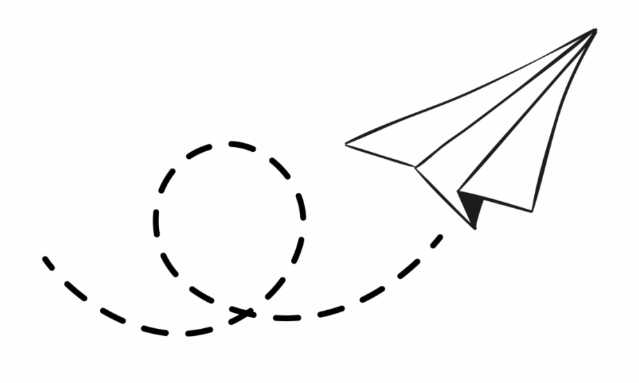

<div id="top"></div>

[![Forks][forks-shield]][forks-url]
[![Stargazers][stars-shield]][stars-url]
[![Issues][issues-shield]][issues-url]
[![MIT License][license-shield]][license-url]
[![LinkedIn][linkedin-shield]][linkedin-url]

<!-- PROJECT LOGO -->
<br />
<div align="center">
  <a href="./public/images/website-logo.png">
    
  </a>

<h3 align="center">Travel Blog</h3>

  <p align="center">
    Travel Blog is a simple and yet modern blogging website which uses modern concepts such as SSR (Server Side Rendering), semantic tags, and clound functions.
    <br />
    <a href="https://github.com/th3N0m4d/travel-blog/wiki"><strong>Explore the docs »</strong></a>
    <br />
    <br />
    <a href="https://nextjs-travel-blog.vercel.app/">View Demo</a>
    ·
    <a href="https://github.com/th3N0m4d/travel-blog/issues">Report Bug</a>
    ·
    <a href="https://github.com/th3N0m4d/travel-blog/issues">Request Feature</a>
  </p>
</div>

<!-- TABLE OF CONTENTS -->
<details>
  <summary>Table of Contents</summary>
  <ol>
    <li>
      <a href="#about-the-project">About The Project</a>
      <ul>
        <li><a href="#built-with">Built With</a></li>
      </ul>
    </li>
    <li>
      <a href="#getting-started">Getting Started</a>
      <ul>
        <li><a href="#prerequisites">Prerequisites</a></li>
        <li><a href="#installation">Installation</a></li>
      </ul>
    </li>
    <!-- <li><a href="#usage">Usage</a></li> -->
    <li><a href="#roadmap">Roadmap</a></li>
    <li><a href="#contributing">Contributing</a></li>
    <li><a href="#license">License</a></li>
    <li><a href="#contact">Contact</a></li>
    <li><a href="#acknowledgments">Acknowledgments</a></li>
  </ol>
</details>

<!-- ABOUT THE PROJECT -->

## About The Project

This project's main goal is to explore the myriad of technologies and approaches catered to the blogging community.

My main focus will be on using modern technologies such as Nextjs and AWS services, such as Cloud Functions.

The second goal of this project is to learn about the unique challenges posed by this kind of app, i.e. making the website as SEO (Search Engine Optimization) friendly as possible, accessibility, performance and content management.

<p align="right">(<a href="#top">back to top</a>)</p>

### Built With

- [Next.js](https://nextjs.org/)
- [React.js](https://reactjs.org/)
- [Vercel](https://vercel.com/)

<p align="right">(<a href="#top">back to top</a>)</p>

<!-- GETTING STARTED -->

## Getting Started

Please, follow the instructions below in order for your to be able to run and experiment with this project.

### Prerequisites

- npm
  ```sh
  npm install npm@latest -g
  ```

### Installation

1. Clone the repo
   ```sh
   https://github.com/th3N0m4d/travel-blog.git
   ```
2. Install NPM packages
   ```sh
   npm install
   ```
3. Run project locally
   ```sh
   npm run dev
   ```

<p align="right">(<a href="#top">back to top</a>)</p>

<!-- USAGE EXAMPLES -->

<!-- ## Usage

Use this space to show useful examples of how a project can be used. Additional screenshots, code examples and demos work well in this space. You may also link to more resources.

_For more examples, please refer to the [Documentation](https://example.com)_

<p align="right">(<a href="#top">back to top</a>)</p> -->

<!-- ROADMAP -->

## Roadmap

### New Features

- [ ] Offline Mode
- [ ] Collect User Analytics
- [ ] Make Website SEO Friendly
- [ ] Add to Home Screen
- [ ] Ability To Create Blogs
- [ ] Comment Management With Disqus
- [ ] Contact Me Page
- [ ] About Me Page
- [ ] CSS Theme Based On OS'

### Enhancements

- [ ] Replace Custom CSS With Tailwind
- [ ] Simplify Imports With Module Aliases
- [ ] Improve README File Wording
- [ ] Use Ramda

### Bugs

- [ ] Blog Posts Are Not Correctly Laid Out

### QA

- [ ] Integration Tests With TestCafe:
- [ ] Enable Test Coverage With Coveralls
- [ ] Handle Rendering Errors With Error Boundary

### Deployment Pipeline

- [ ] Ability To Preview Deployments

See the [open issues](https://github.com/th3N0m4d/travel-blog/issues) for a full list of proposed features (and known issues).

<p align="right">(<a href="#top">back to top</a>)</p>

<!-- CONTRIBUTING -->

## Contributing

Contributions are what make the open source community such an amazing place to learn, inspire, and create. Any contributions you make are **greatly appreciated**.

If you have a suggestion that would make this better, please fork the repo and create a pull request. You can also simply open an issue with the tag "enhancement".
Don't forget to give the project a star! Thanks again!

1. Fork the Project
2. Create your Feature Branch (`git checkout -b feature/AmazingFeature`)
3. Commit your Changes (`git commit -m 'feat: Add some AmazingFeature'`)
4. Push to the Branch (`git push origin feature/AmazingFeature`)
5. Open a Pull Request

<p align="right">(<a href="#top">back to top</a>)</p>

<!-- LICENSE -->

## License

Distributed under the MIT License. See `LICENSE.txt` for more information.

<p align="right">(<a href="#top">back to top</a>)</p>

<!-- CONTACT -->

## Contact

Edie - [edielton.dantas@hotmail.com](edielton.dantas@hotmail.com)

Project Link: [https://github.com/th3N0m4d/travel-blog](https://github.com/th3N0m4d/travel-blog)

<p align="right">(<a href="#top">back to top</a>)</p>

<!-- ACKNOWLEDGMENTS -->

## Acknowledgments

The website's look and feel was based on a free Wordpress template developed by the talented Sal from Wow Themes.

Click [here](https://www.wowthemes.net/moschino-free-wordpress-theme/) to see more from Sal.

<p align="right">(<a href="#top">back to top</a>)</p>

[forks-shield]: https://img.shields.io/github/forks/th3N0m4d/travel-blog.svg?style=for-the-badge
[forks-url]: https://github.com/th3N0m4d/travel-blog/network/members
[stars-shield]: https://img.shields.io/github/stars/th3N0m4d/travel-blog.svg?style=for-the-badge
[stars-url]: https://github.com/th3N0m4d/travel-blog/stargazers
[issues-shield]: https://img.shields.io/github/issues/th3N0m4d/travel-blog.svg?style=for-the-badge
[issues-url]: https://github.com/th3N0m4d/travel-blog/issues
[license-shield]: https://img.shields.io/github/license/th3N0m4d/travel-blog.svg?style=for-the-badge
[license-url]: https://github.com/th3N0m4d/travel-blog/blob/main/LICENSE.txt
[linkedin-shield]: https://img.shields.io/badge/-LinkedIn-black.svg?style=for-the-badge&logo=linkedin&colorB=555
[linkedin-url]: https://www.linkedin.com/in/n0m4d/
[product-screenshot]: blob:https://vercel.com/e857696d-c0c3-450d-a605-741cb4840e21
